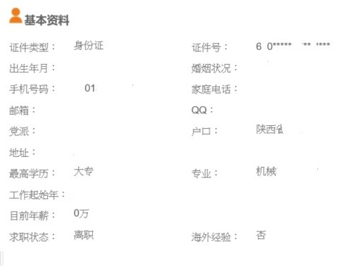

# Parse Exchange mail for python

### 此repo為練習exchangelib+bs4

### 使用的模組
- Beautifulsoup4
- exchangelib


### Installation
```bash
pip install exchangelib
```

### 使用情境
假設信箱中有一封信進來，想要去把這封信格式化並存進資料庫
<br>**以下圖為示意圖，敏感資料已經清除**
)


### 資料格式
```python
personal_data={
        'recruit':'',
        'find_job':'',
        'name':'',
        'age':'',
        'gender':'',
        'highest_education' : '' ,
        'want_job_name' :'' ,
        'work_experience' : '',
        'recent_work' : '',
        'address' : '',
        'email' : '',
        'cellphone' : '',
        'contact_method' : '',
        'resume_file':'',
        'Time':'',
        'ID':'',
        'creation_time':''
    }
```

### config.py
```python
# define email account
username = ''
password = ''
primary_smtp_address = '' # example@xxx.con.tw
server = '' #mail.xxx.com.tw
```

